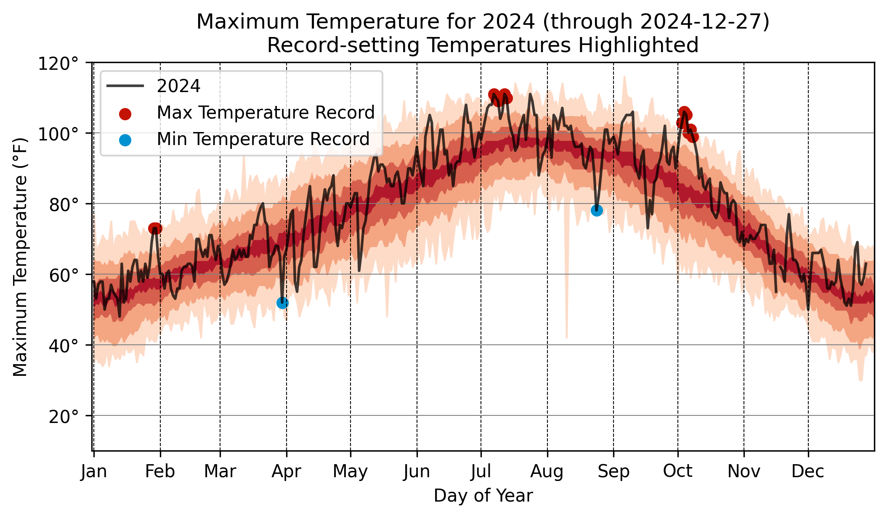

# merced-weather-py
This repository creates a daily updated weather graph using python, and it is a recreation of the merced-weather repository.

Full disclosure: Original author is [John Johnson](https://github.com/jdjohn215)

